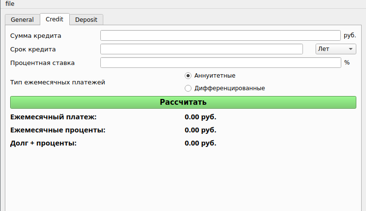

SMART_CALC.v_2.0

### MVC pattern

Realiztion MVC.

### Polish notation and reverse Polish notation

The expression written in conventional infix notation:

>2 / (3 + 2) * 5

The expression written in Polish prefix notation:

>\* (/ 2 (+ 3 2)) 5

Normally parentheses between operations of equal priority are unnecessary and the final expression looks like this:

>\* / 2 (+ 3 2) 5

The expression written in Reverse Polish (bracketless) notation:

> 2 3 2 + / 5 *

### Dijkstra's algorithm

## Implementation of SmartCalc

## Bonus. Credit calculator

## Bonus. Deposit calculator

